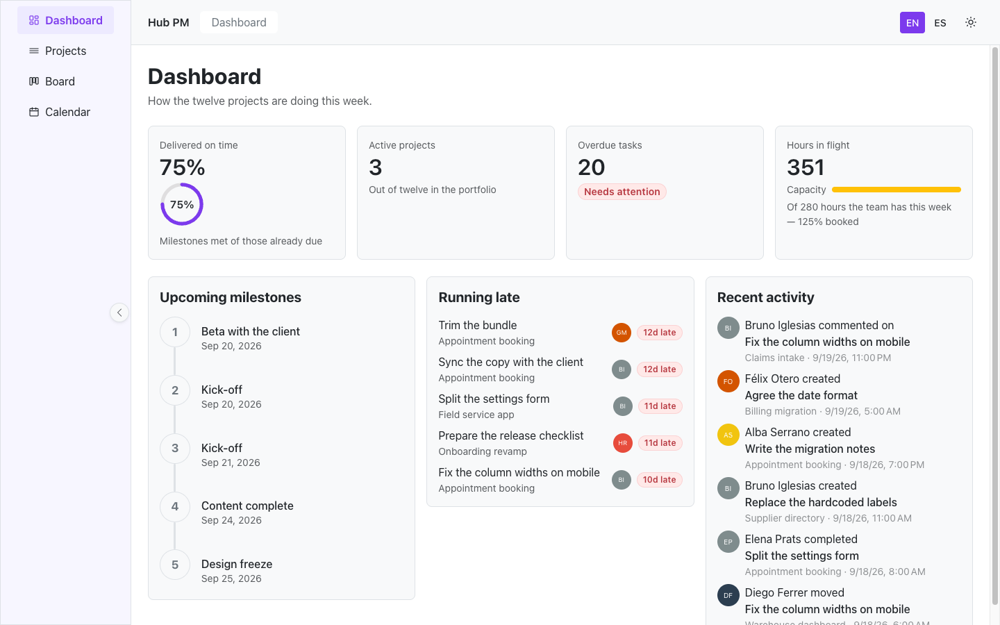
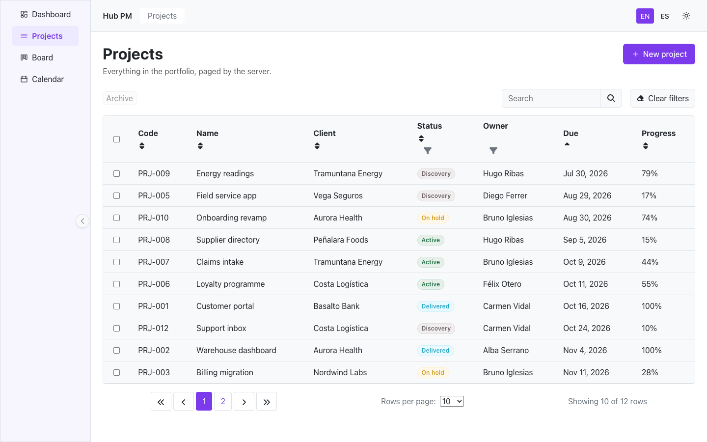
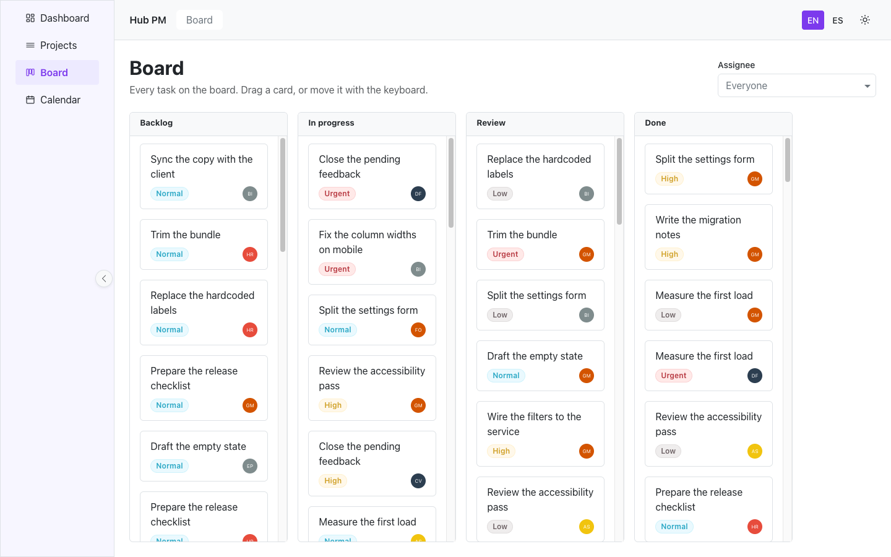
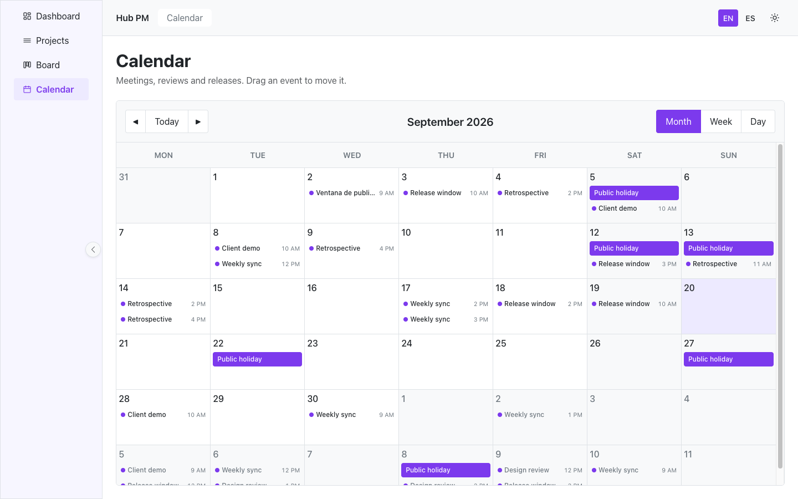

# Hub PM — the Hub UI demo app

A project management app built only with [Hub UI](https://github.com/hub-env/hub-ui)
packages: navigation, data table, kanban board, calendar, forms, stepper, modal
and toasts, with no other UI framework in the dependency tree.

It installs the `ng-hub-ui-*` packages from npm, exactly as any consumer would,
so cloning this repository is also a check that the published packages work
together.

**Live at [demo.hubui.dev](https://demo.hubui.dev/).**



## What it shows

**A data table that pages on the server.** The page, the search, the two column
filters and the order all travel to the service, which answers with the shape
the table reads in server mode. Rows are selectable and the selection feeds a
batch action.



**A kanban board with keyboard moves.** Cards drag between columns, and they
also move with the keyboard: Space grabs, the arrows move, Space drops. Either
way the move goes through the service before the board redraws. Clicking a card
opens its detail as a drawer.



**A calendar in month, week and day.** Dragging an event moves its day and keeps
the time and the length it had. Clicking one opens it for editing, down to the
minute.



**A three-step wizard** behind "New project", where each step stays shut until
the one before it is valid, and **both themes and both languages** across every
screen — including the labels inside the table, the stepper and the calendar,
which read the app's dictionary through the Hub UI translation bridge.

## Run it

```bash
npm install   # npm 11 or later
npm start
```

Then open http://localhost:4200. There is no backend: the data lives in the
browser, generated from a fixed seed so every run — and every screenshot — gets
the same twelve projects, eight people and their tasks.

```bash
npm test          # the suite
npx ng build      # production build
```

## Which package does what

| Screen    | Packages                                                 |
| --------- | -------------------------------------------------------- |
| Shell     | nav, breadcrumbs, loading, icons, buttons, ds, utils     |
| Dashboard | metrics, milestones, avatar, badges, skeleton            |
| Projects  | paginable, stepper, modal, forms, buttons, toast, badges |
| Board     | board, modal (drawer), avatar, badges                    |
| Calendar  | calendar, modal, forms                                   |

## Stack

Angular 22, standalone and zoneless, with signals and `OnPush`. Vitest for the
tests, Transloco for English and Spanish, and the `ng-hub-ui-ds` design tokens
for both themes.

The initial bundle is 626 kB raw and 140 kB over the wire, of which Angular
accounts for 368 kB and the navigation for 127 kB.

## Deployment

Easypanel builds the image in this repository on every change to `main` and
serves it at [demo.hubui.dev](https://demo.hubui.dev/). The `Dockerfile` builds
the app with node and hands the result to nginx, which falls back to
`index.html` so a reload on an inner route answers with the app rather than a 404.

## Part of Hub UI

Stars, issues and the roadmap live in the main repository:
[hub-env/hub-ui](https://github.com/hub-env/hub-ui).

## License

MIT — see [LICENSE](./LICENSE).
